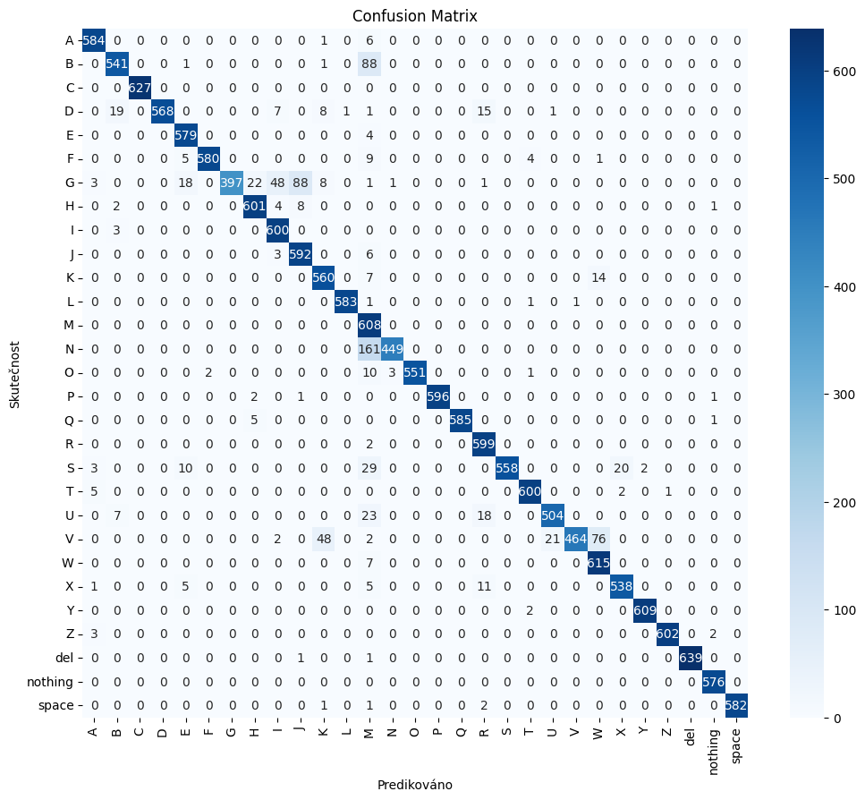

# ASL Sign Language Classifier 🧠🖐️

This project is a convolutional neural network (CNN) classifier for American Sign Language (ASL) hand gestures using the [ASL Alphabet Dataset](https://www.kaggle.com/datasets/grassknoted/asl-alphabet).  
The model is trained in PyTorch using **ResNet18** with transfer learning.

## 📁 Dataset
- Dataset: [ASL Alphabet](https://www.kaggle.com/datasets/grassknoted/asl-alphabet)
- Contains 29 classes (A–Z, `nothing`, `space`, `del`)
- Over 87,000 labeled images (one folder per class)

## 🧠 Model
- Architecture: ResNet18 (`torchvision.models.resnet18`)
- Transfer learning with `weights=ResNet18_Weights.DEFAULT`
- Final layer replaced with `Linear(..., 29)`
- Optimizer: Adam, LR = 0.001
- Loss: CrossEntropyLoss
- Accuracy: **99.7 % on validation set**

## 📊 Evaluation
- Confusion Matrix
- Classification Report (Precision, Recall, F1 per class)
- Visual inspection of predictions



## 🧪 How to use

You can run the notebook on [Kaggle](https://www.kaggle.com) or locally if you have GPU access.

```bash
pip install torch torchvision matplotlib seaborn scikit-learn
```

Download the dataset from Kaggle and structure it as:

```
/asl-alphabet/
└── asl_alphabet_train/
    ├── A/
    ├── B/
    ├── ...
```

Then run the notebook:  
`asl-cnn-classifier.ipynb`

## 📌 Notes
- Includes confusion matrix and `classification_report()` for full interpretability
- Designed for learning and experimentation
- Great base for sign language recognition projects

## 🧑‍💻 Author
- [@No898](https://github.com/No898)

---
